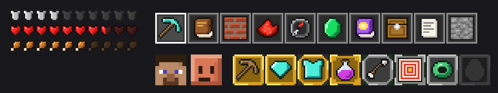

# claude-mods

Mods for [Claude Code](https://claude.com/claude-code), installable as a plugin marketplace.

| Mod | What it does |
|---|---|
| [CodeCraft](codecraft/README.md) | A Minecraft-inspired HUD for Claude Code: hearts for context, armor for safety nets, XP for verified work, in-game chat, and 60 advancements that persist across sessions. |



## Install

You need Claude Code 2.1.288 or later. In Claude Code, add this marketplace once, then install a mod from it:

```
/plugin marketplace add mkpvishnu/claude-mods
/plugin install codecraft@claude-mods
```

To get updates later, run `/plugin marketplace update claude-mods`.

## Contributing

Issues and pull requests are welcome. Each mod's README has a Develop section with the commands to run it from a checkout, type check it and run its tests.

## License

[MIT](LICENSE)

CodeCraft is not an official Minecraft product. It is not approved by or associated with Mojang or Microsoft.
