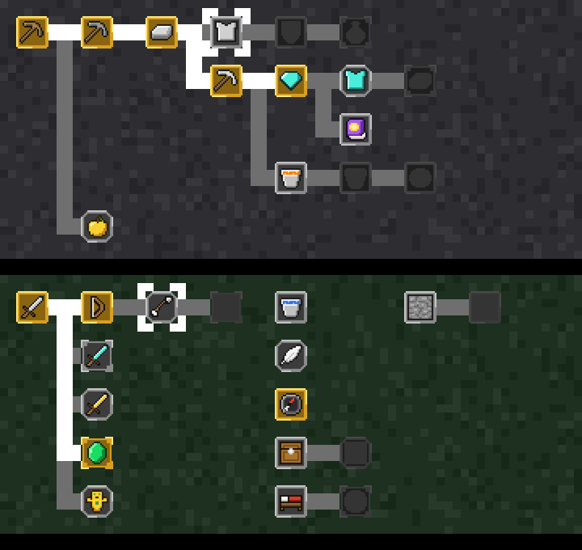

# claudecraft

A Minecraft HUD for Claude Code. The hearts are your context window, the armor is how safe your work is, the XP bar fills only for verified work, and the conversation reads like in-game chat. Each piece of the screen shows something real about the session, so you can read the state of your work the way you read a game screen.


Not affiliated with Mojang or Microsoft.

## Install

You need Claude Code 2.1.288 or later. In Claude Code, run:

```
/plugin marketplace add mkpvishnu/claude-mods
/plugin install claudecraft@claude-mods
```

Start a new session and the HUD appears above the prompt. Nothing else is needed. The status line is an optional extra, described [below](#status-line).

## The HUD

The band above the prompt is laid out like the game's: armor over the hearts, food on the right, the XP bar underneath, and the hotbar while a turn runs.

| Element | What it shows |
|---|---|
| Hearts | Context window left. Ten full hearts is a fresh session. When health runs low, a warning suggests `/compact`. |
| Food | Your five-hour usage limit left. |
| Armor | Safety nets, out of 10 points: tests green since your last edit (4), work committed (3), commits pushed (3). Shown only inside a git repository. |
| Level and XP bar | Experience for verified work: green test runs, turning a red run green, commits made with the tests green. Plain tool calls earn nothing. Resets each session. |
| Hotbar | While a turn runs, one slot per tool used in that turn with its call count. The tool in hand has a white frame. Subagents show as villagers. |
| Boss bar | A shell command that has run for 5 seconds, draining toward its timeout. |

Each kind of tool has its own item in the hotbar:

| Item | Tool |
|---|---|
| Pickaxe | Searching code and finding files |
| Book | Reading files |
| Bricks | Editing and writing files |
| Redstone | Shell commands |
| Compass | Web search and fetch |
| Emerald | Subagents |
| Enchanted book | Skills |
| Chest | MCP tools |
| Paper | The to-do list |
| Stone | Anything else |

## The chat

The conversation reads like a Minecraft server chat:

- The CLAUDECRAFT title, in stone letters on a strip of grass, sits above your first prompt, with a splash line and `<you> joined the game`.
- Your prompts appear under `<your name>` beside the player's head, and replies under `<Claude>` beside Claude's block head.
- Tool calls are short gray lines such as `[Claude: ran pytest -q]` or `[Claude: edited src/app.py]`. A failed call turns red and gets a death message.
- Skill and MCP tool lines carry an enchantment mark (✦).
- Advancements are announced the way the game does it: `<your name> has made the advancement [Stone Age]`.
- The footer names the permission mode as a game mode: Survival (default), Creative (accept edits), Adventure (auto), Spectator (plan) and Hardcore (bypass permissions).

## Advancements

There are 60 advancements across the game's five tabs, earned by real work and saved across sessions. Six are hidden until you earn them.

| Tab | What it covers | Examples |
|---|---|---|
| Minecraft | Building and verifying | Stone Age (edit a file), Diamonds! (commit with the tests green), A Furious Cocktail (tests, checks and build all green) |
| Nether | Subagents and git history | We Need to Go Deeper (send out a subagent), Hidden in the Depths (find a bad commit with git bisect) |
| The End | Pull requests and releases | The End? (open a pull request), Free the End (merge one), The City at the End of the Game (cut a release) |
| Adventure | Testing and exploring | Monster Hunter (turn a red test run green), Bullseye (green on the first run 10 times in a row), Is It a Bird? (search the web) |
| Husbandry | Habits over days | A Seedy Place (write a new test file and see it pass), Homesteader (work 7 days in a row), Old Growth (30 days in a row) |

Run `/advancements` to open the advancements screen. Each tab is drawn as the game's tree, with every advancement joined by a line to the one it comes after:



- **Frame colour:** gold means earned, stone means open, and dark means locked until the advancement before it is earned.
- **Frame shape:** square for a task, rounded for a goal, spiked for a challenge. Challenges also give bonus XP.
- **Moving around:** keys `1` to `5` switch tabs, `n` and `p` move the white marker, and the line above the tree says what the marked advancement asks for. Pointing at an icon with the mouse shows that one instead.

`/inventory` prints your level, verification state, armor, edited files and earned advancements as text.

## Terminals

The icons are image sprites at the game's own resolution. They need a terminal that can show images, such as [kitty](https://sw.kovidgoyal.net/kitty/) or [Ghostty](https://ghostty.org). On other terminals with true colour the mod draws the same things as block art made of text, and on a narrow terminal it falls back to plain symbols. Nothing needs configuring: the mod checks the terminal at the start of each session.

## Status line

The mod ships a status line (`scripts/statusline.sh`, needs `jq`) showing the directory, git branch and changes, model, exact context and usage figures, and the time.

A mod cannot replace your status line by itself, so your own status line script has to hand over to it. Put this at the top of your script, right after it reads its input into `$input`:

```bash
if [ -n "$CLAUDECRAFT_STATUSLINE" ] && [ -x "$CLAUDECRAFT_STATUSLINE" ]; then
    printf '%s' "$input" | "$CLAUDECRAFT_STATUSLINE"
    exit
fi
```

The mod sets `CLAUDECRAFT_STATUSLINE` only in sessions where it is loaded, so your own status line comes back when the mod is off. Without this step everything else still works.

## Privacy and what it runs

The mod makes no network requests and sends nothing anywhere. It never changes or blocks a tool call; it only watches them to spot test runs, commits and failures. Outside of drawing, it does four things:

- Runs read-only `git` commands in your working directory to find the repository root and whether your work is committed and pushed. This feeds the armor bar.
- Saves your levels and advancements in the plugin's own store file under `~/.claude/plugins/store/`.
- Reads the `USER` environment variable for the name on your chat lines, and `TERM`, `TERM_PROGRAM` and `KITTY_WINDOW_ID` to tell whether the terminal can show images.
- Sets the `CLAUDECRAFT_STATUSLINE` environment variable for the session, used by the status line step above.

## Develop

Clone the repository and run Claude Code with the mod loaded from your checkout. It reloads when you save a file.

```
git clone https://github.com/mkpvishnu/claude-mods
cd claude-mods
claude --plugin-dir ./claudecraft
```

| Task | Command |
|---|---|
| Type check | `npx -p typescript@5 tsc -p claudecraft` |
| Validate the plugin | `claude plugin validate --strict ./claudecraft` |
| Run the tests | `cd claudecraft && claude plugin test` |
| Redraw the sprites | `python3 claudecraft/tools/sprites.py` (needs Pillow) |

The code is in `hooks/`: `register.tsx` holds the hooks and the drawing, and `lore.ts` holds the pure helpers such as the advancement list, levels, chat wording and the advancement tree layout. The sprites in `assets/` are generated from the letter art in `tools/sprites.py`, so edit that file and rerun it to change one.

## License

MIT
